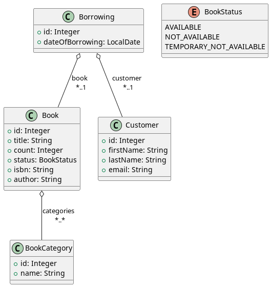

# Wete3

# Specification of project Library
Basic functions of application:
- create, edit, delete of book, book category and customer
- list and show detail of book, book category, customer and borrowings
- create borrowing and return borrowed book to library
- add/delete book category to/from book 

## Domain model

## FE requirements
- features of application separated into own directories (Books, BookCategories, Customers, Borrowings)
- each feature has its own service and model
- each feature is composed of components for 
  - page (parent component)
  - list (child component)
  - form (child component)
  - detail
- usage of Angular Forms
- implemented validators in all forms
- navigation between features is handles by Routing
- communication between parent and child components is handled by @Input and @Output
- communication between Angular application and Spring Boot application is handled via REST calls implemented in services
- subscriptions are correctly unsubscribed
- data are correctly shown and saved from/into server (Spring Boot application)

# API
API is specified using OpenAPI v3. You can render this API via [Swagger editor](https://editor.swagger.io/).
Please copy OpenAPI content into Swagger editor to render it. 
You can find OpenAPI specification for this application [here](specification/openapi.md).

# Visualizations
Screens of sample application can be found [here](specification/visualizations.md).
