# Git basics

## Repository and project initialization
  - vytvor repozitár na Github.com
  - vytvor lokálnu kópiu repozitára
      - git clone https://github.com/KI-FPV-UMB/library-fe.git (url ku vašemou repozitáru)
  - vytvor Angular projekt do lokálneho repozitára
      - ng new library-fe
  - prejdi do priečinku, ktorý teraz obsahuje lokálny repozitár spolu s Angular projektom
      - cd library-fe
  - zobraz aktuálny stav zmien v lokálnom repozitári (malo by vypísať súbory Angular projektu – ako napríklad package.json, tsconfig.json, angular.json a priečinok /src)
      - git status
      - súbory sú zatiaľ červenou farbou – nepridané do zoznamu súborov, ktoré chceme commit-núť – takzvaný unstage stav
  - pridaj súbory do zoznamu na commit-nutie (tzv. stage)
      - git add .
      - add .  - pridá všetky súbory do stage stavu, súbory sa dajú ale pridávať aj len jednotlivo v prípade, že nechceme commit-núť všetky upravené súbory. Dokonca sa dajú do stage pridávať aj len časti zmenených súborov.
  - Zobraz aktuálny stav zmien – po aplikovaní príklazu git add nám git status zobrazí všetky súbory pripravené na commit zelenou farbou
      - git status
  - Vytvor commit – záznam o aplikovaných zmenách súborov v repozitári
      - git commit – m “moj prvy commit”
  - Zobraz aktuálny stav zmien – po aplikovaní príklazu git commit nám git status už nezobrazuje žiadne ne-commit-nuté zmeny v lokálnom repozitári
      - git status
  - Zobraz históriu commit-ov
      - git log
      - 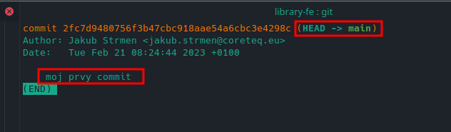
      - tlačidlom q – opusti zobrazenie histórie
  - Upload commit na vzdialený repozitár (github)
      - git push -u origin main
      - -u nastaví cieľový remote repozitár (origin – defaultne Váš vzialený repozitár z ktorého bola vytvorená lokálna kópia) a vetvu (main)

Teraz by mal byť aj lokálny aj vzdialený repozitár v korektnom stave pripravený na vypracovanie domácej úlohy.

## Create new branch
  - Zobraz aktuálny stav zmien – nemali by byť žiadne aplikované zmeny (ideálne)
      - git status
  - Zobraz aktuálnu vetvu – tú z ktorej chceme vytvoriť novú vetvu
      - git branch
  - Ak nie sme v tej, z ktorej chceme vychádzať, prepneme sa do nej
      - git checkout main
  - Vytvor novú vetvu z aktuálneho stavu
      - git checkout -b jstrmen/uloha1
  - Otvor projekt v IDE a vypracuj úlohu
  - Po vypracovaní úlohy pokračuj podobným spôsobom ako pri inicializácii projektu
      - git status (nepovinné)
      - git add . (alebo konkrétne súbory)
      - git status (nepovinné)
      - git commit -m “kratka sprava co je obsahom commitu”
      - git push -u origin jstrmen/uloha1 (prípadne len git push ak vetva už existuje vo vzdialenom repozitári)
  - priebežne si vieme skontrolovať aktuálny stav commitov, či už lokálnych alebo vzdialených
      - git log
      - 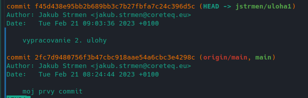
      - takto môžeme vidieť, kde sa aktuálne nachádzame (HEAD) a kde sa nachádza aktuálny main, či už lokálny alebo vzdialený
      - pre aktualizáciu lokálnej vetvi pozri príkazy git fetch a git pull

## Create tag
  - Zobraz aktuálny lokálny commit – tag potrebujeme vytvoriť na poslednom commite, ktorý bol vytvorený a upload-nutý pri vypracovaní domácej úlohy
      - git log
      - 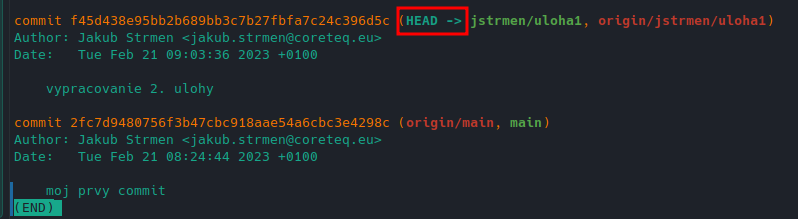
  - Vytvor tag
      - git tag jstrmen-uloha1
  - Skontroluj lokálne vytvorený tag a jeho umiestnenie
      - git log
      - 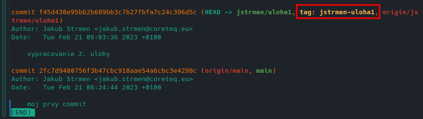
  - Upload tagu 
      - git push origin jstrmen-uloha1
          - iba jedného konkrétneho tagu podľa názvu
      - git push origin –-tags
          - všetkých tagov
    - Kontrola tagu a jeho obsahu vo vzdialenom repozitári (github.com)
      - 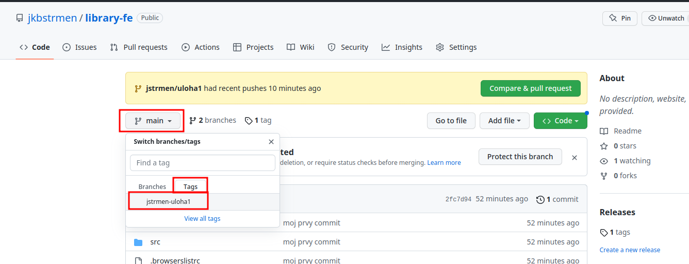 
      - po kliknutí na príslušný tag by zdrojové kódy mali obsahovať požadovanú verziu Angular projektu pre danú domácu úlohu
        - napríklad kontrola súboru app.component.html
        - 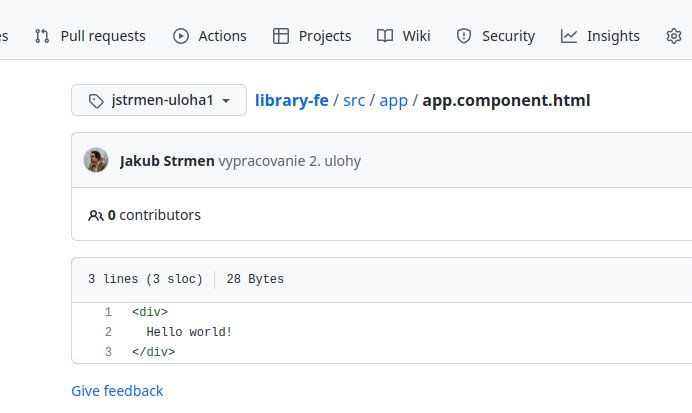

## Create pull request
  - Mal by si mať pushnuté všetky commit-y ku danej úlohe
  - Choď do vzdialeného repozitára na github.com
  - Vytvor pull request
    - 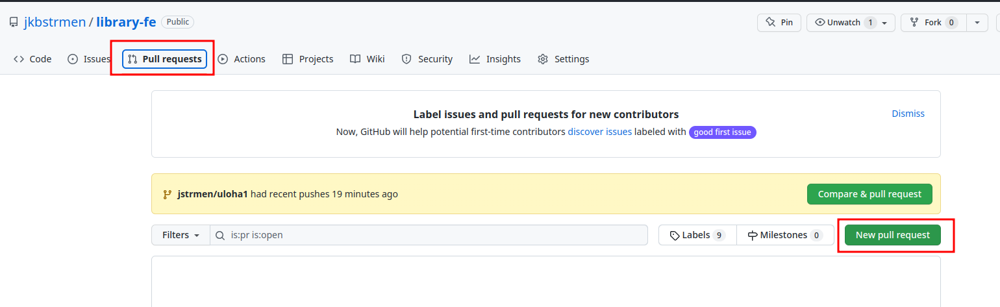
  - Nastav zdrojovú a cieľovú vetvu
    - 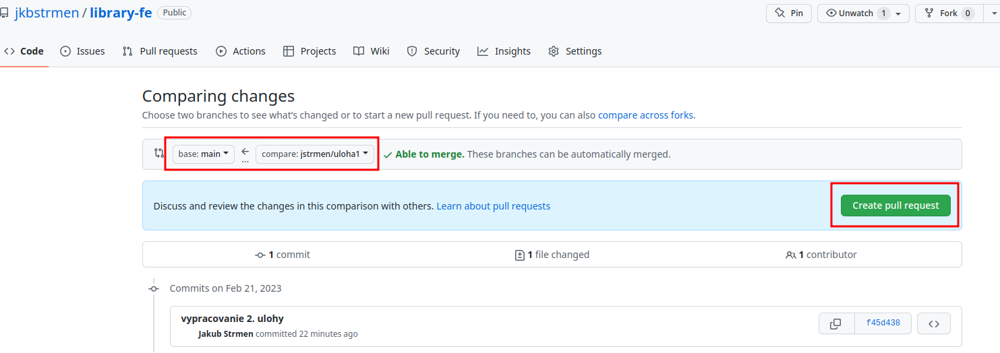
  - zadaj názo a popis a potvrď vytvorenie 
    - 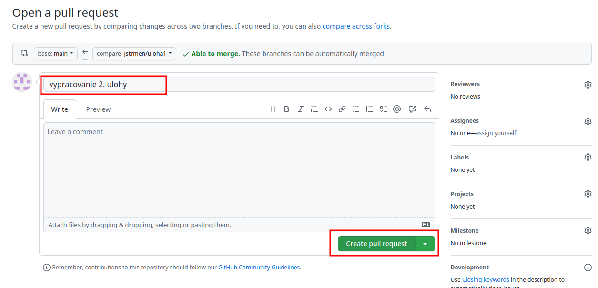
  - V prípade, že sú všetky zmeny aplikácie korektné a nevyskytli sa žiadne konflikty – potvrď merge
    - 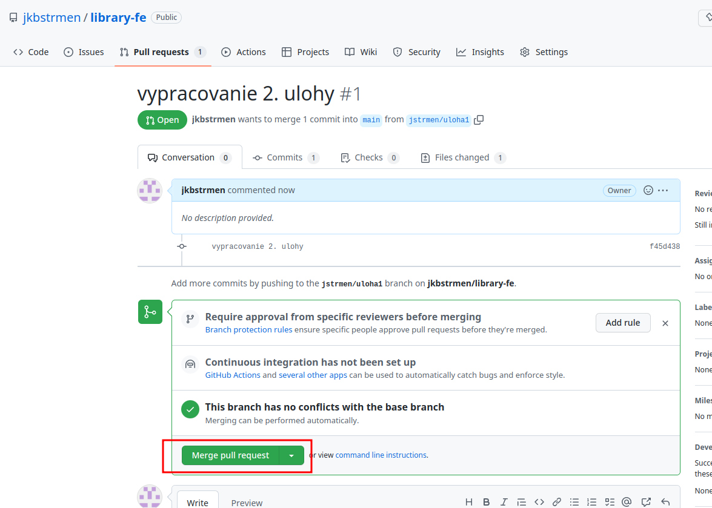
  - Kontrola mergnutia 
    - 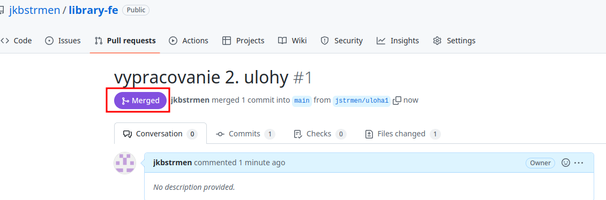

## Git GUI
Grafické nástroje na správu git repozitárov.

### Jetbrains – IntelliJ, WebStorm
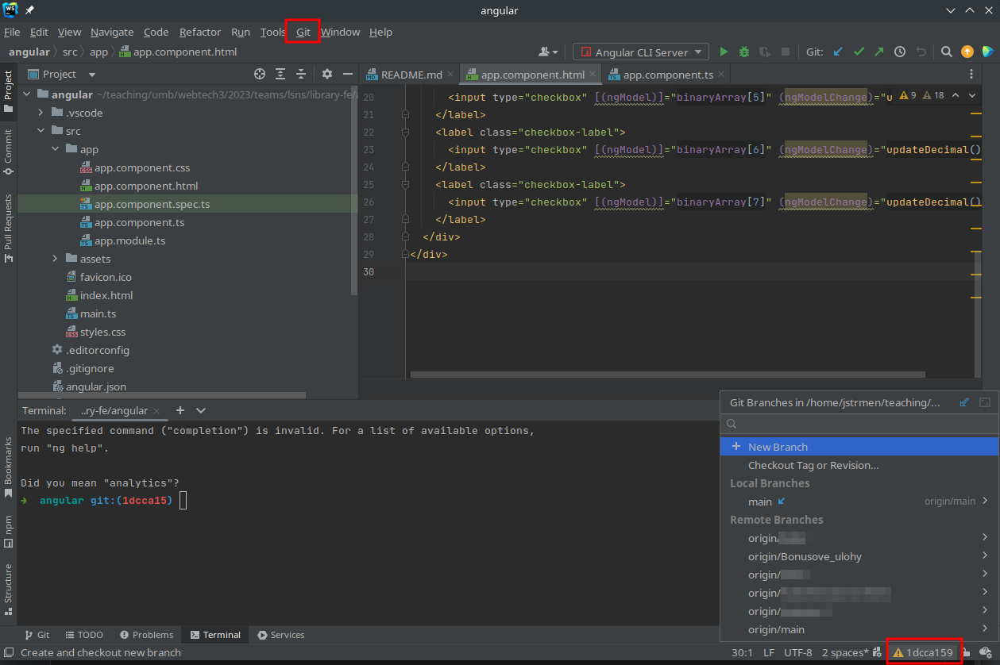

### Gitkraken
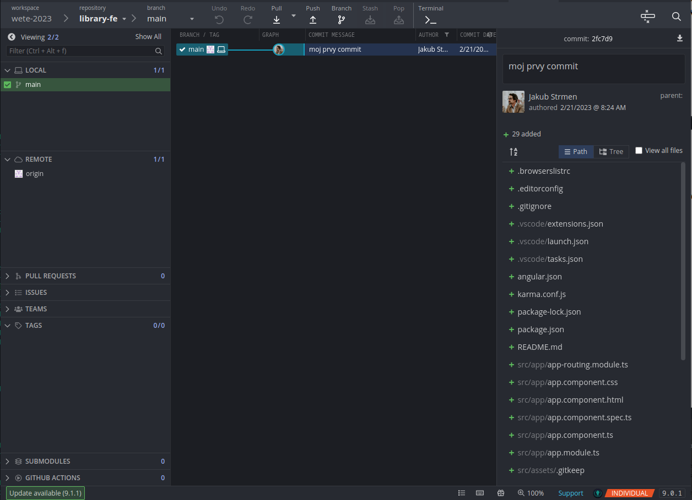

### Iné
https://git-scm.com/downloads/guis

